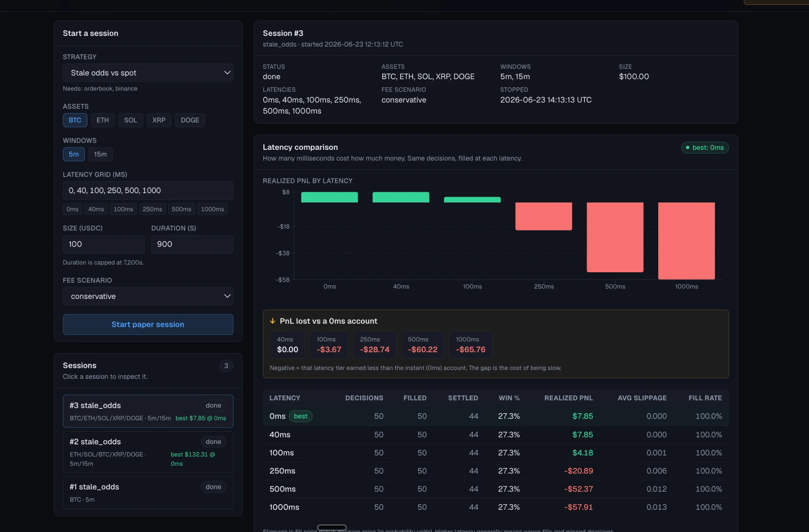
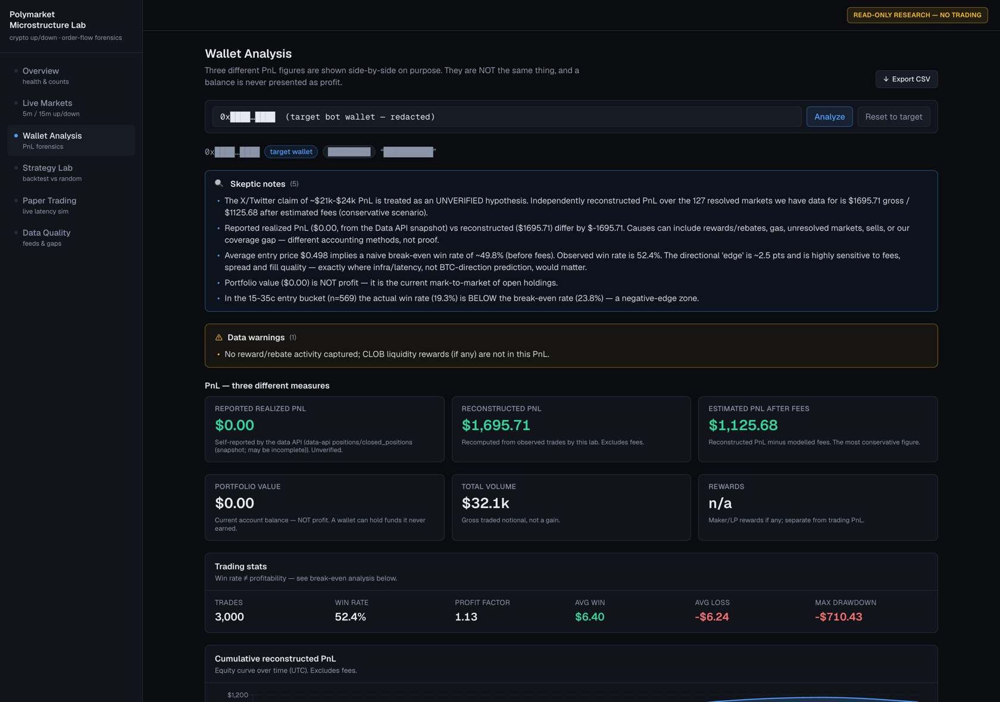

# polymarket-microstructure-lab

**A read-only research lab that puts a Polymarket trading bot's "edge" on trial.** It reconstructs a
target wallet's PnL from public data, computes the win rate that wallet would need just to break
even, and forward-paper-trades its apparent strategy across a grid of network latencies to see
whether the edge survives real-world fees and delay.

> **TL;DR verdict.** I put a Polymarket crypto Up/Down bot's "edge" on trial and found it was
> **fee-eaten microstructure, not prediction.** Independently reconstructing the wallet's trades
> gives roughly **$1.7k gross but only ~$1.1k after fees (fees eat ~34% of gross)** over 127
> resolved markets, with a **52.4% win rate against a ~49.8% break-even** — a razor-thin directional
> edge. When the same "stale odds" strategy is paper-traded live, it is **about break-even at zero
> latency and loses money at any realistic latency** (roughly +$8 at 0 ms decaying to **-$58 at
> 1 s** on a $100 stake). The "edge" is a latency/fee artifact, and Polymarket's fees are designed
> to tax exactly the near-50/50 trades it depends on.

This is a deliberately skeptical, **read-only** tool. It never trades, never touches a private key,
and is **not** a money-making system — the entire point is that the money-making claim does not hold
up. Anyone can run it against their own target wallet with their own (public) configuration.

---

## Screenshots

**Forward paper trading — the edge dies with latency.** The same decisions filled at six latencies;
green at 0–100 ms, red at 250 ms+. By the time a real retail order would actually arrive, the profit
is gone. This is the thesis in one picture.



**Wallet PnL forensics — reconstructed, not the headline claim.** Three PnL figures kept strictly
separate: $0 reported, **$1,695.71 reconstructed gross, $1,125.68 after fees** (~34% fee drag);
52.4% win vs ~49.8% break-even, with the negative-edge entry zone flagged in the skeptic notes.
*(The target wallet's identity is redacted here; the tool itself ships with no wallet baked in.)*



---

## The question, and why it matters

Crypto "prediction bot" wallets are routinely screenshotted on social media with eye-popping PnL
("this bot made $21k–$24k on Polymarket BTC Up/Down"). Those claims are almost never independently
checked. This project treats one such claim as an **unverified hypothesis** and tries to falsify it
with public data:

- Is the reported profit even real once you **reconstruct it from the on-chain trades** rather than
  trusting a screenshot?
- If there is any edge, does it come from **predicting BTC**, or from **market microstructure** —
  entry price vs required win rate, stale odds, latency, queue position, and **fees**?

The answer matters because the second kind of "edge" does not transfer to you: it is a race against
co-located bots that Polymarket's own fee schedule is built to tax. Proving that *before* risking
money is the whole value of the exercise.

---

## What I found

All numbers below come straight from the analysis code in this repo (`analyze-wallet` and the live
paper-trading engine), not from memory. They are specific to the wallet and window analyzed; the
**method** is what reproduces, and re-running it on other crypto Up/Down bots reaches the same
qualitative conclusion.

### 1. The reconstructed PnL is an order of magnitude below the headline claim

Over **3,000 trades across 127 resolved markets (100% resolution coverage)**, conservative scenario:

| Quantity | Value |
|---|---|
| Reconstructed PnL (gross) | **$1,695.71** |
| Estimated fees paid | **$570.02** (≈ **33.6%** of gross) |
| Reconstructed PnL (after fees) | **$1,125.68** |
| Win rate | **52.35%** |
| Naive break-even win rate (avg entry $0.498) | **~49.8%** |
| Reported realized PnL (Data API snapshot) | $0.00 |

The directional edge is about **2.5 percentage points** of win rate, and **fees consume roughly a
third of the gross**. The result is far below the social-media claim for the same window — and the
report keeps "reported vs reconstructed vs after-fees vs portfolio value" strictly separate so the
different accounting methods are never conflated.

### 2. The "edge" inverts exactly where fees bite

Break-even win rate is computed **dynamically per entry-price bucket** (never hardcoded). In the
**15–35¢ entry bucket (n=569)** the wallet's actual win rate is **19.3%** against a break-even of
**23.8%** — a **negative-edge zone** that alone loses about **-$645**. Buying a share at **$0.97**
needs a **~97%+ win rate just to break even**: at fair value such a trade only pays fees, so any
profit must come from the price being *stale*, i.e. microstructure, not prediction.

### 3. Live, the strategy is break-even at best and latency kills it

A 2-hour forward paper-trading session of the `stale_odds` strategy ($100 stake, conservative fees,
BTC/ETH/SOL/XRP/DOGE, 5m+15m), filling **one decision across six latency accounts**:

| Latency | Win rate | Realized PnL |
|---|---|---|
| 0 ms (physically impossible) | 27.3% | **+$7.85** |
| 40 ms | 27.3% | +$7.85 |
| 100 ms | 27.3% | +$4.18 |
| 250 ms | 27.3% | **-$20.89** |
| 500 ms | 27.3% | -$52.37 |
| 1000 ms | 27.3% | **-$57.91** |

Same decisions, same settlement — the **only** difference is how many milliseconds late the order
arrives. Even at a physically impossible 0 ms the edge is ~breakeven noise; at any latency a real
trader would actually have, it loses. That is the cost of being slow, measured directly.

**Verdict: the edge does not survive fees and latency.** It is a microstructure/latency artifact,
not repeatable prediction.

---

## How it works (methodology, accurate to the code)

- **PnL reconstruction** (`app/analysis/wallet.py`) — pulls the wallet's public trades, activity,
  positions and value from Polymarket's Data API, links each trade to its resolved market, and
  reconstructs realized PnL independently from the reported snapshot. Coverage is reported; low
  coverage is flagged.
- **Break-even & fee engine** (`app/analysis/fees.py`) — computes the break-even win rate from entry
  price + fees + spread **dynamically** for each entry-price bucket, under maker/taker/conservative
  fee scenarios, and reports the edge (actual minus break-even) per bucket.
- **Strategy lab / backtest** (`app/strategies/`) — **12 strategies** (`random`, `always_up`,
  `always_down`, `buy_open`, `buy_60s`, `buy_120s`, `momentum_binance`, `mean_reversion_binance`,
  `chainlink_binance_divergence`, `orderbook_imbalance`, `follow_wallet`, `stale_odds`) replayed over
  *already-resolved* markets using **captured order-book data**, under configurable latency, fill
  model, fees and slippage, always compared against a random baseline, with low-sample warnings.
- **Forward paper trading** (`app/paper/`) — runs a strategy **live**, where the outcome is unknown
  at decision time. A decision made at time *t* only "arrives" at *t + latency* and fills against the
  book **as it moved during that flight**; the same decision is filled across the latency grid
  **0 / 40 / 100 / 250 / 500 / 1000 ms** and each position settles on the **real** market resolution.
  This is the only part that can show adverse selection from latency. It places **no orders** and
  uses **no keys** — it observes public feeds and simulates fills. (Grounded tiers: ~40 ms
  co-located, ~100 ms good server, ~250 ms retail/EU, 500–1000 ms poor link.)

A unit test asserts the core property: on the same decision, a higher-latency account fills worse and
ends with strictly less PnL.

---

## Read-only by construction

This is analysis-only **by design**, and verifiably so:

- **No order placement.** There is no authenticated CLOB trading client, no order signing, no
  EIP-712, no `place_order` anywhere in the codebase. (`grep` it.)
- **No keys, ever.** It never asks for, stores, or uses a private key, seed phrase, or wallet
  connection. The only wallet input is a **public on-chain address** to analyze.
- **Only public, read-only endpoints** — Polymarket Gamma / Data / CLOB REST + the CLOB and RTDS
  websockets, and Binance's public price stream — all rate-limited with backoff, retries and a hard
  per-run request budget.
- **No copy-trading, signals, Telegram/Discord, or social-media scraping.**

This is a deliberate choice: the goal is to *evaluate* a claim rigorously, not to act on it. Removing
the ability to trade removes the temptation to "just try it," which is exactly the mistake the
findings argue against.

---

## Setup and run

**Prerequisites:** Python 3.12, Node 20+, and `make`. SQLite is built in (no database to install);
Postgres is only needed for the optional Docker path.

**No API keys, accounts, or sign-ups are required.** Every data source here is public and
read-only (Polymarket Gamma/Data/CLOB + Binance), so there is nothing to authenticate and no key to
paste anywhere. The *only* value you must provide is `PML_TARGET_WALLET` — a **public** on-chain
wallet address to analyze (never a private key). The endpoint URLs in `.env.example` already point
at the public APIs and only need changing if Polymarket ever moves them.

```bash
git clone <your-fork-url> polymarket-microstructure-lab
cd polymarket-microstructure-lab

make install                      # create the venv, install backend + frontend deps
cp .env.example .env              # then edit .env and set PML_TARGET_WALLET (see below)
make setup                        # create the DB schema + discover current live markets
```

**Point it at your own target wallet.** Open any trader's profile on
[polymarket.com](https://polymarket.com); the public address is in the URL. Put it in `.env`:

```bash
PML_TARGET_WALLET=0xYourPublicTargetWalletAddress   # PUBLIC address only — never a private key
PML_TARGET_PROFILE=optional-label
```

You can also pass it per-command with `--wallet 0x...`. Then:

```bash
make sync-wallet                  # fetch that wallet's public history (Data API)
make analyze                      # print the skeptical PnL + break-even report
```

Run the services (each long-running command wants its own terminal):

```bash
make api                          # backend API  -> http://localhost:8000  (docs at /docs)
make dashboard                    # dashboard     -> http://localhost:3000
make paper                        # optional: a live, simulated paper-trading session
make collect                      # optional: record order-book history for backtests
```

Manual (no `make`): `python3 -m venv backend/.venv && backend/.venv/bin/pip install -r
backend/requirements.txt -r backend/requirements-dev.txt`, then run `backend/.venv/bin/python -m app
<command>`. The full CLI is `python -m app {discover,collect,sync-wallet,analyze-wallet,backtest,
paper-trade,replay,export,serve}`.

---

## Reproduce the headline result

The wallet finding needs only an internet connection and a public wallet address — no captured data,
no secrets:

```bash
cp .env.example .env              # set PML_TARGET_WALLET to a public crypto-Up/Down bot wallet
make install && make setup
make sync-wallet                  # pulls the wallet's public trades/activity/positions
make analyze                      # prints reconstructed gross/after-fees PnL, win rate vs
                                  # break-even, and the per-entry-bucket edge (incl. negative zones)
```

The exact dollar figures depend on the wallet and how much history you sync; the **qualitative
result reproduces**: a thin directional edge, a large fee drag, and negative-edge buckets near the
prices these bots trade. To reproduce the latency finding, run `make paper` (or `python -m app
paper-trade --strategy stale_odds --latencies 0,40,100,250,500,1000`) and compare PnL across the
latency accounts — higher latency settles worse.

---

## Limitations and honesty

- **This is research, not financial advice — and explicitly not a money-making tool.** The finding
  is that the apparent edge is *not* real after fees and latency. Do not trade on it.
- **Scope.** Reconstruction covers the wallet's dominant buy-and-hold flow; partial sells are handled
  at the market-cash-flow level but per-trade attribution assumes holds. Independent PnL can only be
  reconstructed for markets whose resolution was synced; the report states coverage % and warns when
  low.
- **Fees are modelled, not authoritative.** Polymarket's exact fee formula can change; the engine
  uses a market's own fee schedule when present and configurable fallbacks otherwise, always running
  maker/taker/conservative scenarios. Break-even is always computed dynamically, never hardcoded.
- **Backtests are only as good as recorded data.** Without captured order-book history the simulator
  drops to lower-fidelity prices and says so. Run `make collect` first for trustworthy
  microstructure backtests. The RTDS (Chainlink) feed is best-effort and falls back to Binance.
- **Statistical power.** Short windows mean small samples; metrics carry explicit low-sample flags
  below 30 trades, and the 2-hour live session above is a small sample illustrating the *direction*,
  not a precise expectancy.

---

## Tests

```bash
make test        # 91 backend tests, offline (captured fixtures), < 1s
```

Covers the market parser, the break-even/fee model, wallet PnL reconstruction, stale/duplicate/
out-of-order detection, enrichment, the backtest simulator (latency, fill models, no-lookahead
signals, missing-data handling), the tolerant API clients (via `httpx.MockTransport`), and the
forward paper-trading latency engine (the headline test asserts higher latency → strictly lower PnL).

Architecture: `backend/` (Python/FastAPI/SQLAlchemy, 24 DB tables, 12 strategies) + `frontend/`
(Next.js dashboard: overview, live markets, wallet analysis, strategy lab, paper trading, data
quality, market replay). See `docs/API_CONTRACT.md` for response shapes.

---

## License & disclaimer

[MIT](LICENSE).

This software is provided for research and educational purposes only. It is **not** financial,
investment, or trading advice, and it is **not** a tool for making money — its central finding is
that the analyzed "edge" is not real net of fees and latency. Nothing here places trades or handles
keys. Use it to think more clearly, not to risk capital. No warranty; see the license.

**Read-only research only. No trading. No private keys. No wallet connection.**
